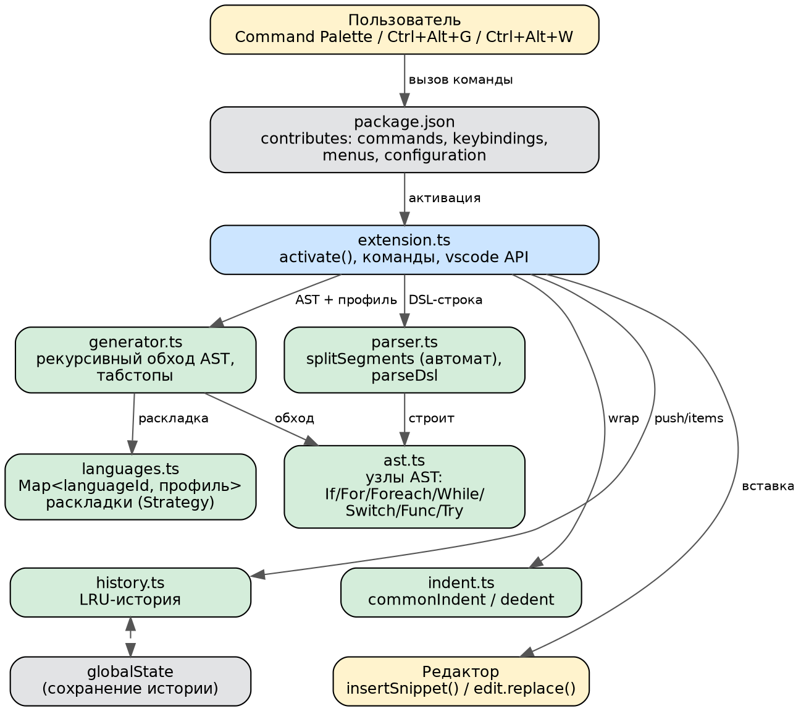

# Документация CodeScaffold

## 1. Назначение

CodeScaffold — расширение VS Code, которое по короткой DSL-строке строит дерево конструкций
и генерирует вложенный код на языке текущего файла. Расширение не использует готовые сниппеты:
текст формируется алгоритмически из AST и языкового профиля.

## 2. Техническое задание (тезисы)

**Функциональные требования**

1. Команда генерации: ввод DSL-строки → вставка кода в позицию курсора.
2. Поддержка конструкций `if/else`, `for`, `foreach`, `while`, `switch`, `func`, `try/finally`.
3. Произвольная вложенность конструкций (до 8 уровней) через разделитель `;`.
4. Команда «обернуть выделение» с сохранением исходных отступов.
5. История последних шаблонов (LRU) с сохранением между сессиями.
6. Поддержка языков: TypeScript, JavaScript, Java, C++, C, Go, Python.
7. Проверка ввода «на лету» с понятными сообщениями об ошибках.

**Нефункциональные требования**

1. Отступы соответствуют настройкам редактора (табуляция / число пробелов).
2. Ядро не зависит от VS Code API и покрыто автотестами.
3. Добавление нового языка — только новым профилем, без правки парсера и генератора.

## 3. Архитектура

### 3.1. Как VS Code подключает расширение

- Расширение — Node.js-модуль, который запускается в отдельном процессе **Extension Host**.
- Манифест `package.json` декларирует вклад (`contributes`): команды, горячие клавиши,
  пункт контекстного меню и настройку `codescaffold.historySize`.
- Расширение активируется лениво при первом вызове своей команды (`activationEvents` вычисляются из `contributes.commands`).
- При активации вызывается `activate(context)`: он регистрирует обработчики команд через
  `vscode.commands.registerCommand` и кладёт их в `context.subscriptions` для автоматического освобождения.
- Редактор изменяется только через API (`insertSnippet`, `edit`), состояние хранится в `context.globalState`.

### 3.2. Модули

| Модуль | Ответственность | Структуры данных / приёмы |
|---|---|---|
| `ast.ts` | Типы узлов, `DslError` | размеченное объединение (discriminated union), связный список `body` |
| `parser.ts` | Разбор DSL | конечный автомат с **стеком скобок** и флагом кавычек; таблица синонимов `Map` |
| `languages.ts` | Профили языков | **Strategy**: для каждого вида узла — функция-построитель раскладки; реестр `Map<languageId, профиль>` |
| `generator.ts` | Генерация кода | рекурсивный обход, контекст с счётчиком табстопов, экранирование |
| `indent.ts` | Отступы | общий префикс, dedent/indent |
| `history.ts` | История | **LRU**-список с дедупликацией и ограничением ёмкости |
| `extension.ts` | Интеграция с VS Code | команды, `InputBox` с валидацией, `QuickPick`, `SnippetString` |

### 3.3. Алгоритм генерации

1. `splitSegments` делит строку по `;` (игнорируя `;` внутри скобок и кавычек).
2. `parseSegment` определяет ключевое слово по таблице синонимов и разбирает аргументы регулярными выражениями.
3. Узлы связываются цепочкой: `nodes[i].body = nodes[i+1]`.
4. `generate` находит самый вложенный узел (`innermost`) — в его основном слоте будет курсор (`$1`) либо выделенный код.
5. `render(node)` запрашивает у профиля **раскладку** — список элементов двух типов:
   *строка* (с относительным отступом) и *слот* (место тела). Для слота основного типа подставляется
   `render(node.body)`, иначе — табстоп/заглушка (`pass` в Python).
6. Результат сдвигается на отступ слота и склеивается; в режиме сниппета `$` и `\` экранируются.

### 3.4. Обёртывание выделения

1. Выделение расширяется до целых строк.
2. Находится базовый отступ первой непустой строки; у всех строк убирается общий отступ (`dedent`).
3. Строки передаются в генератор как `inner` и попадают в основной слот самого вложенного узла.
4. К результату возвращается базовый отступ, и диапазон заменяется одной правкой (`edit.replace`) — отмена `Ctrl+Z` откатывает всё разом.

## 4. Справочник по API (кратко)

| Функция | Описание |
|---|---|
| `splitSegments(input): string[]` | Разбивает DSL по `;` с учётом скобок/кавычек; бросает `DslError` при несбалансированности. |
| `parseDsl(input): AstNode` | Разбирает цепочку, возвращает корень AST. |
| `parseSegment(segment): AstNode` | Разбирает одну конструкцию. |
| `summarize(root): string` | Описание цепочки: `for › if (else) › while`. |
| `generate(root, profile, opts): string` | Генерирует код; `opts = { indentUnit, snippet, inner? }`. |
| `resolveProfile(languageId)` / `listProfiles()` | Доступ к реестру языковых профилей. |
| `commonIndent / dedent / indentLines` | Работа с отступами. |
| `History` (`push`, `items`, `setCapacity`, `restore`) | LRU-история. |

Полные комментарии (JSDoc/TSDoc) находятся в исходных файлах. HTML-документацию можно получить командой
`npx typedoc src/*.ts` (при необходимости — `npm i -D typedoc`).

## 5. Как добавить новый язык

1. В `languages.ts` создайте профиль: для C-подобного языка достаточно вызвать `makeBraceProfile({...})`.
2. Добавьте профиль в список внутри `REGISTRY`.
3. Добавьте тест в `src/test/generator.test.ts`.

## 6. Тестирование

- **Автотесты:** `npm test` — 23 теста (`node:test`) на парсер, генератор всех языков, отступы, историю.
- **Ручная проверка в VS Code (F5):**

| № | Действие | Ожидаемый результат |
|---|---|---|
| 1 | В `.ts`-файле `Ctrl+Alt+G`, ввод `for i 0..n; if i%2==0 else` | Вставлен цикл с `if/else`, курсор — в теле `if` |
| 2 | Ввод `if` (без условия) | В поле ввода красное сообщение об ошибке |
| 3 | В `.py`-файле ввод `foreach x in items; try` | Цикл `for`, внутри `try/except`, в пустых телах `pass` |
| 4 | В `.c`-файле ввод `try` | Сообщение, что `try` в C не поддерживается |
| 5 | Выделить 3 строки, `Ctrl+Alt+W`, ввод `try finally` | Строки обёрнуты, отступы сохранены |
| 6 | Выполнить «История шаблонов» | Список прежних шаблонов, последний — сверху |
| 7 | Перезапустить VS Code → история | История сохранилась |

## 7. Ограничения

- Условия, выражения и имена вставляются «как есть», их корректность не проверяется.
- `foreach` в C работает только для настоящих массивов (используется `sizeof`).
- `switch` в Python генерируется как `match` (требуется Python ≥ 3.10).
